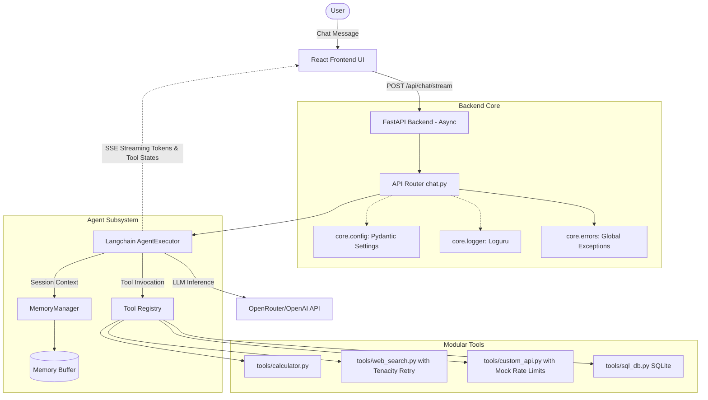

# Production-Quality AI Agent System

This repository contains a full-stack, production-ready AI Agent built with a seamless asynchronous FastAPI backend, LangChain, OpenAI function calling, and a React (Vite + CSS) frontend supporting dynamic streaming.

## Architecture Overview



### Key Features & Enhancements
1. **Dynamic Tool Registry**: Tools are neatly separated into individual modules in `backend/agent/tools/` and dynamically loaded via `ToolRegistry`.
2. **Streaming Responses**: The backend uses `astream_events` to provide a true token-by-token Server-Sent Events (SSE) stream back to the UI, enhancing perceived latency.
3. **Resiliency**: We use `tenacity` decorators to wrap fragile network calls (`web_search_tool`, external APIs) with exponential backoff and retry logic.
4. **Configuration Management**: A Pydantic `BaseSettings` setup in `core/config.py` validates environment variables strictly at boot.
5. **Unified Logging**: Standard Python logging is intercepted and formatted beautifully by `loguru` to give distinct, traceable terminal output.
6. **Global Error Handling**: FastAPI route errors are caught by centralized domain exception handlers.
7. **Docker Support**: Quick setup via `docker-compose up --build`.

## Observability, Tracing, and Evaluation

The system is fully instrumented for performance, debugging, and evaluation tracking via environment toggles (`ENABLE_TRACING=True`, `ENABLE_METRICS=True`, `ENABLE_EVAL=True`).

### 1. Tracing
Tracing operates at a per-node level inside the unified LangGraph execution to ensure maximum visibility without impacting SSE (Server-Sent Events) streaming to the client.
- **Node Wrappers**: Every step (retrieval, LLM processing, tool execution) is automatically timed, traced, and logged to `graph_traces.jsonl`.
- **LangSmith Integration**: Standard integration available via `LANGCHAIN_TRACING_V2=true` in `.env`.
- **Streaming Telemetry**: Token chunks, `on_tool_start`, `on_chain_end` retrieval operations, and total payloads are extracted synchronously out of the async `astream_events` stream—meaning logs emit instantly as models predict generation.

### 2. Metrics Collection
A centralized `RequestMetrics` accumulator context securely tracks variables across the lifecycle of asynchronous API requests:
- Tracks total endpoint latency, cache-hit status, unique tool-call names and counts, and LLM Token inputs/outputs.
- When the request completes (or fails), an aggregated JSON is flushed non-blockingly to `request_metrics.jsonl`.
- You can poll live statistical health metrics at the `/api/metrics` endpoint.

### 3. Evaluation
A dedicated End-to-End Evaluation test harness provides insights into RAG quality against the active, real Vector Store and Compiled LangGraph instance.
- **Diagnostics**: Triggers the system to extract precise similarity chunk scores (BM25 or Cosine Similarity) and absolute file names, dumping them safely to `retrieval_diagnostics.jsonl`. 
- **How to run tests**: 
  1. Populate `backend/data/eval.json` with evaluation pairs (questions and what the `expected_source` file should be).
  2. Run `python scripts/eval_graph.py` from the `backend/` directory.
  3. The script bypasses mocked databases, compiles the true LangGraph, parses the LLM output for logical sanity, checks whether the expected source document was successfully injected into context, and emits a neat formatted checklist with ms-latency per case.

## Setup Instructions

### Option 1: Docker (Recommended)
1. Provide an `.env` file in the `backend/` directory:
   ```ini
   OPENROUTER_API_KEY=your_key_here
   LOG_LEVEL=INFO
   ```
2. Run the full stack:
   ```bash
   docker-compose up --build
   ```
3. Visit `http://localhost:5173`.

### Option 2: Local Development

#### Backend Setup
1. Navigate to `backend/`.
2. Create and activate a virtual environment:
   ```bash
   python -m venv venv
   source venv/bin/activate  # On Windows: venv\Scripts\activate
   ```
3. Install dependencies:
   ```bash
   pip install -r requirements.txt
   ```
4. Create `backend/.env` with your `OPENROUTER_API_KEY`.
5. Run the server:
   ```bash
   uvicorn main:app --reload --host 0.0.0.0 --port 8000
   ```

#### Frontend Setup
1. Navigate to `frontend/`.
2. Install dependencies:
   ```bash
   npm install
   ```
3. Run the development server:
   ```bash
   npm run dev
   ```

## Production Deployment
- **API Endpoints**: `API_URL` within `frontend/src/api.js` points to `localhost` by default. Update this to your production backend URL natively or via `Vite` environment variables.
- **State**: The `MemoryManager` currently uses in-memory Python dictionaries. For multi-worker deployments, inject a native Redis `BaseChatMessageHistory` adapter.
